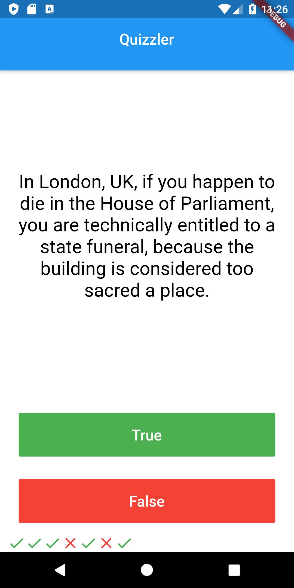
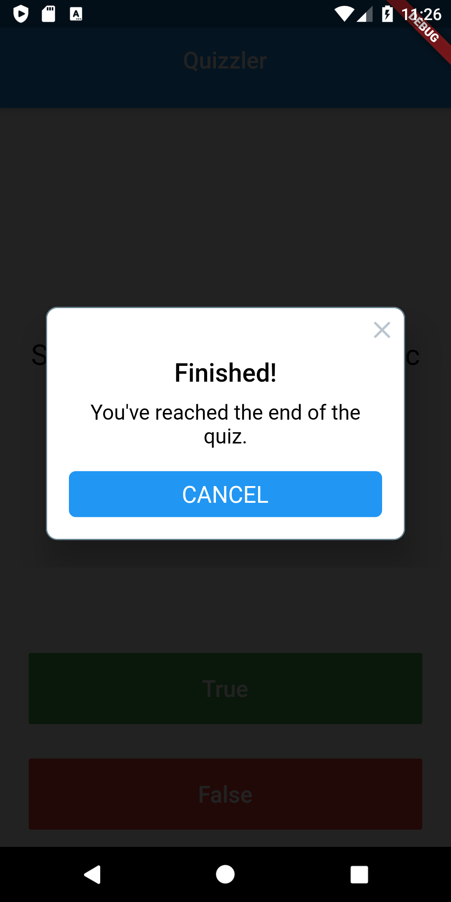

# Quizzler ❓

## 🥅 Goal

In this tutorial we will be reviewing Stateful and Stateless Widgets as well as learning about the fundamental building blocks of Object Oriented Programming (OOP) - Classes and Objects. 

## 🤔 What is this app?! 

This is a quiz app that tests your general knowledge. As one of the most popular types of apps on the app stores, you can create your own quiz for other people to enjoy!

## What i learned 

- Modularising your code into separate classes.
- Dart classes and objects.
- Using class constructors.
- Extracting Widgets to refactor your code.
- private and public modifiers in Dart.
- How to use Dart lists.
- The difference between var, const and final.
## Screenshots
 

